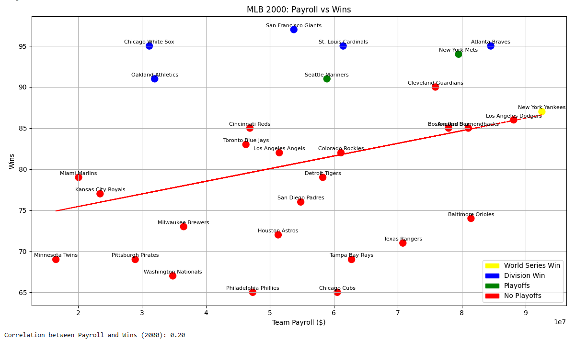
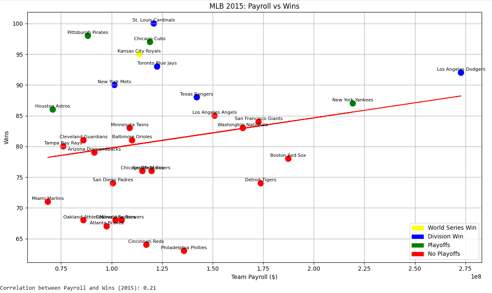
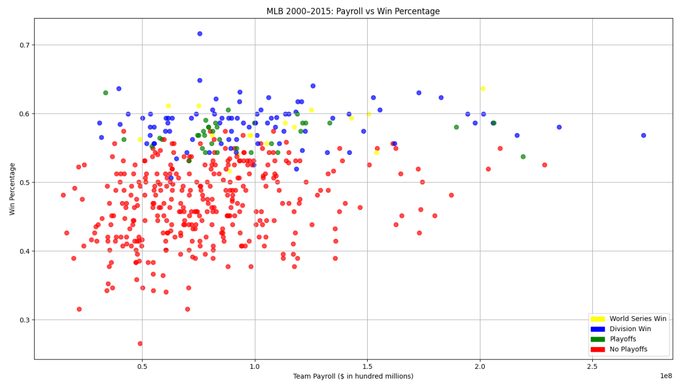
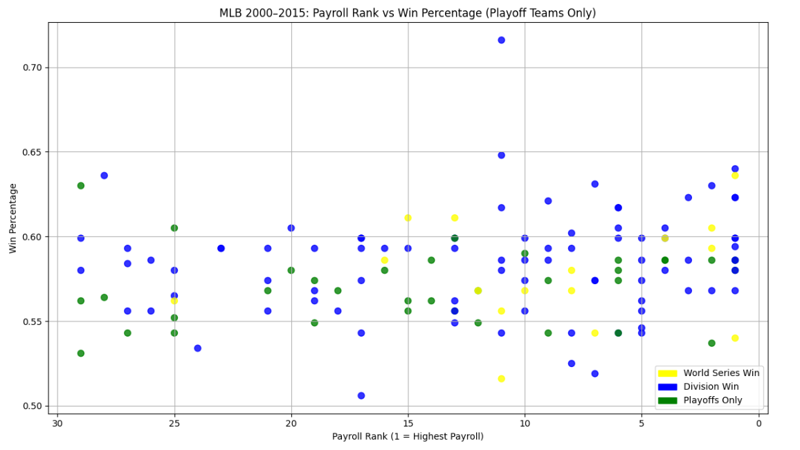
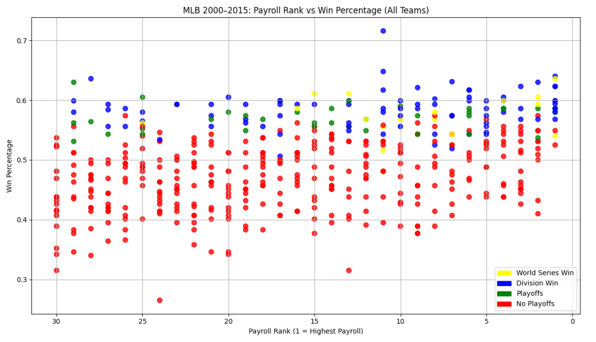
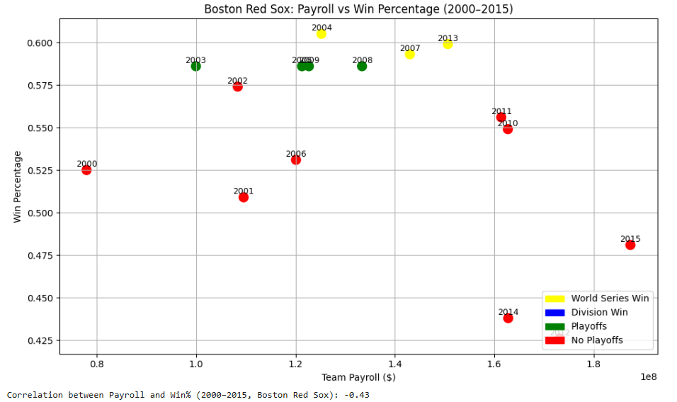
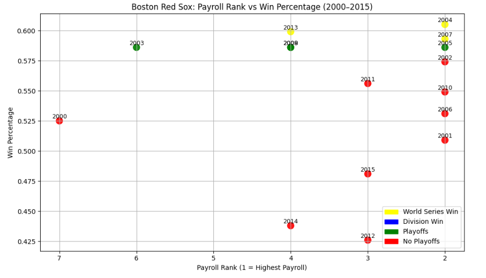

# CS506 Midterm Report

**Youtube Link:**

**Overview**

Goal of project: Find a correlation between playoff/team success based on payroll in the MLB. 

**1. Preliminary Visualizations of Data**

I created several visualizations to explore the relationship between team payroll and on-field performance from 2000–2015.

1. Wins vs Payroll (2000 and 2015)

- Scatterplots showing each team’s number of wins versus total payroll for the years 2000 and 2015.
- These plots illustrate how the league’s payroll landscape and win distributions have changed over time.
  

2. Win% vs Payroll (2000–2015, All Teams)

- Scatterplot of all teams from 2000–2015.
- Each point is color-coded based on whether the team made the playoffs, won their division, or won the World Series.

This helps visualize whether higher payrolls are associated with postseason success.

3. Payroll Rank vs Win%
- Two scatterplots: one including all teams, and one including only playoff teams.
- These visualizations highlight whether top payroll rankings correspond to higher win percentages.

4. Team-Specific Trend 

- Two plots showing payroll vs win% and payroll rank vs win% for one specific team from 2000–2015.
- This helps analyze whether the league-wide correlation between payroll and success holds true for an individual franchise.

**2. Data Processing**

Data was collected and cleaned using Python scraping functions.

Data Sources:
- SteveTheUmp: Active roster payroll data for all MLB teams (2000–2015).
- Pro Baseball Reference: Team win–loss records, division placements, and postseason results.

All data was saved into CSV files. 

Data Cleaning Steps:
- Combined datasets by year and team name.
- Handled missing data (Added incomplete payroll numbers).
- Updated team names to present day for consistency
  
Created new features:
- Payroll Rank (rank within league for that season)
- Binary playoff/division/World Series win indicators

Final Dataset:
- Record Sheet: ~480 total team-seasons (30 teams × 16 years).
- Columns include: Year, League, Division, Team, W, L, Wpct, Playoffs, DivisionWin, WorldSeriesWin

- Payroll Sheet: ~480 total team-seasons (30 teams × 16 years).
- Columns include: Year, Rank, Team, Payroll

**3. Data Modeling Methods**

So far, the focus of the project has been on exploratory data analysis and visualization to identify potential relationships between team payroll and success metrics.

Work Completed to Date:
- Conducted visual analysis through scatterplots of payroll vs. win percentage for 2000 and 2015.
- Created a combined scatterplot (2000–2015) showing all teams, color-coded by playoff/division/World Series outcomes.
- Generated payroll rank vs win% graphs (for all teams and for playoff teams only).
- Produced team-specific visualizations to see whether the overall correlation holds for a single franchise.

Planned Modeling Approaches
In the next phase (November–December), I plan to implement the following models:

Linear Regression
- To quantify the correlation between Payroll, Payroll Rank, and Win Percentage.
- Will help determine how much payroll explains variation in win%.

Decision Tree Classifier (Planned)
- To predict binary outcomes such as playoff appearances or division wins.
- Evaluation metrics will include Precision, Recall, and ROC-AUC.

Clustering (Planned)
- To identify natural groupings of teams based on Payroll, Win Percentage, and Playoff Success.

**4. Preliminary Results**

League-Wide Findings:

There is a weak/moderate correlation between payroll and win percentage.
Most teams that are top 5 in payroll make the playoffs, while teams in the bottom 5 rarely make it.
However, several outliers demonstrate that success is possible without top spending (smaller-market teams performing above expectations).
The World Series champion is almost always in the top half of payroll.

Team-Specific Findings for the Boston Red Sox:

The relationship between payroll and win percentage for the Boston Red Sox is moderate/high.
The Red Sox were in the top 7 every year from 2000-2015, and they won 3 championships. However, they only make the playoffs 6 of the 16 years.

Quantitative Insights:

Correlation between payroll and win%: r = .20

